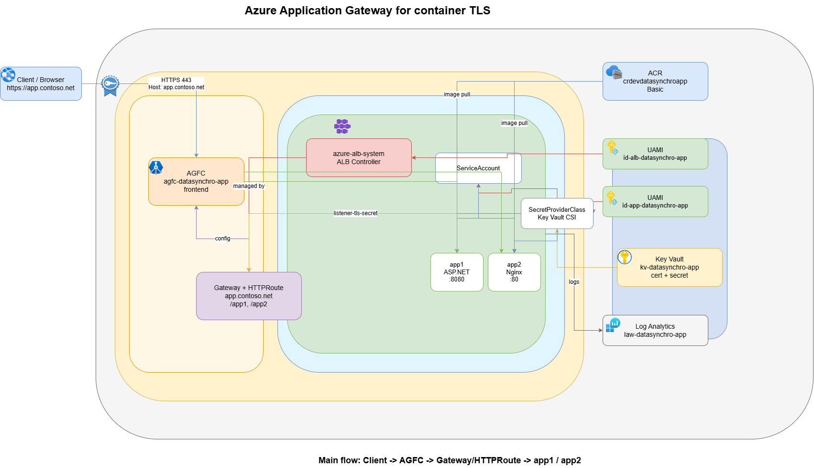

# Azure Application Gateway for Containers sample

This repository provisions and deploys a small AKS-based sample behind **Azure Application Gateway for Containers (AGFC)**. It exposes two paths on the same host:

- `/app1` -> ASP.NET sample app
- `/app2` -> Nginx default home page

The solution uses:

- **Bicep** for Azure infrastructure
- **Helm** for Kubernetes resources
- **Azure Key Vault + Secrets Store CSI** for app secret and TLS material
- **Azure Workload Identity** for pod access to Key Vault
- **Azure Container Registry (ACR)** for application images

add C:\Users\LEYE-GORA\source\repos\AZURE WARRIORS\azure-application-gateway-for-containers\solution-architecture.drawio  here

## Architecture



At a high level:

1. A client sends HTTPS traffic to `https://app.contoso.net`
2. AGFC terminates TLS using a certificate synced from Key Vault
3. A `Gateway` + `HTTPRoute` forwards:
   - `/app1` to the ASP.NET service
   - `/app2` to the Nginx service
4. Both workloads run in AKS and pull images from ACR
5. The application namespace uses a workload identity-backed service account to access Key Vault through the Secrets Store CSI driver

An editable draw.io diagram is included at:

- `solution-architecture.drawio`

## What gets deployed

The Bicep templates create these core Azure resources in `francecentral`:

- Resource group: `RG-APPLICATION-GATEWAY-FOR-CONTAINER`
- AKS cluster: `aks-datasynchro-app`
- ACR: `crdevdatasynchroapp`
- AGFC traffic controller: `agfc-datasynchro-app`
- Key Vault: `kv-datasynchro-app`
- Log Analytics workspace: `law-datasynchro-app`
- User-assigned managed identities:
  - `id-alb-datasynchro-app`
  - `id-app-datasynchro-app`
- VNet: `vnet-datasynchro-app`
  - `snet-aks`
  - `snet-agfc`

The Helm chart deploys:

- `Gateway`
- `HTTPRoute`
- `SecretProviderClass`
- application service account
- `app1` deployment + service
- `app2` deployment + service

## Repository layout

| Path | Purpose |
| --- | --- |
| `main.bicep` | Subscription-scope entry point |
| `main.resources.bicep` | Resource group infrastructure |
| `main.bicepparam` | Default deployment parameters |
| `helm-chart\` | Kubernetes application chart |
| `deploy\deploy.ps1` | End-to-end AKS + Helm deployment |
| `build_and_deploy_images.ps1` | Pull, tag, and push images to ACR |
| `deploy-certificate.ps1` | Create and import self-signed TLS certs into Key Vault |
| `solution-architecture.drawio` | Editable architecture diagram |

## Prerequisites

Install and sign in with:

- **Azure CLI** (`az`)
- **PowerShell 7+** (`pwsh`)
- **Az PowerShell module**
- **kubectl**
- **Helm 3**
- **Docker**

You also need:

- Azure permissions to deploy resources in the subscription
- permission to create role assignments
- permission to import certificates and manage secrets in Key Vault

Before running the deployment scripts:

```powershell
Connect-AzAccount
az login
```

## Configuration

### Bicep parameters

Default values are in `main.bicepparam`:

```bicep
param location = 'francecentral'
param resourceGroupName = 'RG-APPLICATION-GATEWAY-FOR-CONTAINER'
param environmentName = 'dev'
param resourceSuffix = 'datasynchro-app'
param keyVaultCertificatesOfficerObjectId = '<your-object-id>'
```

Update `keyVaultCertificatesOfficerObjectId` to the Microsoft Entra object ID of the user or service principal that will run certificate import operations.

### Helm defaults

The Helm chart defaults already target the ACR images mirrored by this repo:

- `crdevdatasynchroapp.azurecr.io/samples:aspnetapp`
- `crdevdatasynchroapp.azurecr.io/nginx:1.25`

The default public host is:

- `app.contoso.net`

Route prefixes are:

- `/app1`
- `/app2`

## Deploy infrastructure

Optionally preview the subscription deployment:

```powershell
$subscriptionId = "<your-subscription-id-or-name>"
Set-AzContext -SubscriptionId $subscriptionId

New-AzSubscriptionDeployment `
  -Name "datasynchro-appgw-container" `
  -Location "francecentral" `
  -TemplateFile .\main.bicep `
  -TemplateParameterFile .\main.bicepparam `
  -DeploymentDebugLogLevel All `
  -WhatIf
```

Deploy the Azure resources:

```powershell
$subscriptionId = "<your-subscription-id-or-name>"
Set-AzContext -SubscriptionId $subscriptionId

az bicep build --file .\main.bicep
az bicep build --file .\main.resources.bicep

New-AzSubscriptionDeployment `
  -Name "datasynchro-appgw-container" `
  -Location "francecentral" `
  -TemplateFile .\main.bicep `
  -TemplateParameterFile .\main.bicepparam `
  -DeploymentDebugLogLevel All
```

## Deploy images and applications to AKS

The main deployment entry point is:

```powershell
.\deploy\deploy.ps1
```

This script performs the full application deployment:

1. Resolves the managed identities, Key Vault, AKS cluster, and AGFC resource
2. Gets AKS credentials
3. Installs or upgrades the AGFC ALB controller
4. Generates a self-signed wildcard certificate for `*.contoso.net`
5. Imports the certificate into Key Vault
6. Ensures the `app-secret` Key Vault secret exists
7. Runs `build_and_deploy_images.ps1` to mirror the application images into ACR
8. Lints and deploys the Helm chart
9. Waits for rollouts and TLS secret sync
10. Validates `/app1` and `/app2` through the AGFC endpoint

### Important defaults in `deploy.ps1`

| Setting | Default |
| --- | --- |
| Resource group | `RG-APPLICATION-GATEWAY-FOR-CONTAINER` |
| AKS cluster | `aks-datasynchro-app` |
| ACR | `crdevdatasynchroapp` |
| AGFC traffic controller | `agfc-datasynchro-app` |
| Key Vault | `kv-datasynchro-app` |
| App namespace | `datasynchro-app` |
| Hostname | `app.contoso.net` |
| TLS secret | `listener-tls-secret` |

You can override them with parameters, for example:

```powershell
.\deploy\deploy.ps1 -AcrName "myregistry" -ApplicationForContainerHostName "app.contoso.net"
```

## Mirror images to ACR only

If you want to sync the container images without running the full AKS deployment:

```powershell
pwsh -NoProfile -ExecutionPolicy Bypass -File .\build_and_deploy_images.ps1 -acrName crdevdatasynchroapp
```

That script:

- pulls `mcr.microsoft.com/dotnet/samples:aspnetapp`
- pulls `nginx:1.25`
- retags them for your ACR
- pushes them to:
  - `crdevdatasynchroapp.azurecr.io/samples:aspnetapp`
  - `crdevdatasynchroapp.azurecr.io/nginx:1.25`

## Endpoints

After deployment, the expected behavior is:

- `https://app.contoso.net/app1` -> ASP.NET sample page
- `https://app.contoso.net/app2` -> Nginx welcome page

`HTTPRoute` uses prefix rewrite for both routes so the backends receive `/`.

If local DNS is not configured for `app.contoso.net`, you can still validate with the AGFC FQDN and `curl --resolve`:

```powershell
$fqdn = kubectl get gateway datasynchro-app-gw -n datasynchro-app -o jsonpath='{.status.addresses[0].value}'
$fqdnIp = (Resolve-DnsName $fqdn | Where-Object { $_.Type -eq "A" } | Select-Object -First 1 -ExpandProperty IPAddress)

curl.exe -k --resolve "app.contoso.net:443:$fqdnIp" "https://app.contoso.net/app1" --insecure
curl.exe -k --resolve "app.contoso.net:443:$fqdnIp" "https://app.contoso.net/app2" --insecure
```

## Kubernetes resources

Key chart behaviors:

- TLS is terminated at the `Gateway`
- `listener-tls-secret` is synced from Key Vault by the Secrets Store CSI driver
- `datasynchro-app-sa` is annotated for workload identity
- both app pods mount Key Vault-backed content through the CSI driver
- `app1` listens on container port `8080`
- `app2` listens on container port `80`

## Troubleshooting

### `No active Az PowerShell context was found`

Run:

```powershell
Connect-AzAccount
Set-AzContext -SubscriptionId "<subscription>"
```

### Certificate import fails

Make sure the identity running `deploy-certificate.ps1` has the Key Vault certificate-related permissions expected by the Bicep deployment, and that `keyVaultCertificatesOfficerObjectId` is set correctly in `main.bicepparam`.

### `curl: (35) Recv failure: Connection was reset`

This can happen briefly during rollout while backend pods are still being replaced. Retry after the deployments become ready:

```powershell
kubectl get pods -n datasynchro-app
kubectl rollout status deployment/app1-deployment -n datasynchro-app
kubectl rollout status deployment/app2-deployment -n datasynchro-app
```

### TLS secret not found

Check:

```powershell
kubectl get secret listener-tls-secret -n datasynchro-app
kubectl get secretproviderclass -n datasynchro-app
```

### Chart validation

You can lint the chart manually:

```powershell
helm lint .\helm-chart `
  --set azure.appIdentityClientId=dummy `
  --set azure.keyVaultName=dummy `
  --set azure.tenantId=dummy `
  --set azure.agfcId=dummy `
  --set gateway.hostname=app.contoso.net `
  --set route.hostname=app.contoso.net
```

## Notes

- The certificate workflow currently creates a **self-signed wildcard certificate** for `*.contoso.net`
- `deploy.ps1` runs the image mirroring script via `pwsh -ExecutionPolicy Bypass` to avoid local script execution-policy blocking
- The repo is designed around the defaults in `main.bicepparam`, `deploy\deploy.ps1`, and `helm-chart\values.yaml`
